# AI Prompt - Tạo PlantUML Class Diagram cho Hệ thống Booking Khách sạn

> **Mục đích**: Prompt này được thiết kế để sử dụng với AI (ChatGPT, Claude, Gemini, v.v.) để generate ra **CODE PlantUML** hoàn chỉnh cho hệ thống đặt phòng khách sạn.

---

## 🎯 PROMPT CHO AI (Copy toàn bộ phần dưới đây)

```
Hãy viết code PlantUML để tạo class diagram cho hệ thống đặt phòng khách sạn (Hotel Booking System) với TOÀN BỘ spec sau:

=== CẤU TRÚC PHÂN LỚP ===

Controller Layer:
- BookingController
  * Attributes: bookingService (IBookingService), logger (Logger), validator (RequestValidator)
  * Methods: 
    - makeReservation(guestId: String, roomIds: List<String>, checkIn: Date, checkOut: Date): Booking
    - cancelReservation(bookingId: String): boolean
    - getBookingDetails(bookingId: String): Booking
    - getAllBookings(): List<Booking>

Service Layer:
- IBookingService (Interface)
  * Methods:
    - checkAvailability(rooms: List<Room>, checkIn: Date, checkOut: Date): boolean
    - calculateTotal(booking: Booking): double
    - applyDiscount(booking: Booking, discountCode: String): void
    - processPayment(booking: Booking, paymentMethod: String): Payment

- BookingService (implements IBookingService)
  * Attributes: bookingRepository (IBookingRepository), roomRepository (IRoomRepository), discountCalculator (DiscountCalculator)
  * Methods: (tất cả methods từ IBookingService) + createBooking(guest: Guest, rooms: List<Room>, checkIn: Date, checkOut: Date): Booking

Repository Layer:
- IBookingRepository (Interface)
  * Methods: save, delete, findById, findAll, findByGuestId

- BookingRepository (implements IBookingRepository)
  * Attributes: database (DatabaseConnection), queryBuilder (QueryBuilder), cache (CacheManager)
  * Methods: save, delete, findById, findAll, findByGuestId

- IRoomRepository (Interface)
  * Methods: save, findById, findAvailableRooms

Entity Layer:
- Hotel
  * Attributes: id (String), name (String), address (String), phone (String), rating (int)
  * Methods: addRoom, removeRoom, getRooms, updateInfo

- Room
  * Attributes: id (String), roomNumber (String), floor (int), price (double), status (String)
  * Methods: isAvailable, getPrice, getRoomType, updateStatus

- RoomType
  * Attributes: id (String), name (String), description (String), basePrice (double), capacity (int)
  * Methods: getName, getBasePrice, getCapacity, updatePrice

- Guest
  * Attributes: id (String), firstName (String), lastName (String), email (String), phone (String)
  * Methods: updateInfo, getBookingHistory, getFullName, validateContact

- Booking
  * Attributes: id (String), checkInDate (Date), checkOutDate (Date), totalAmount (double), status (String), discountApplied (double)
  * Methods: addRoom, removeRoom, calculateDuration, getInvoice, updateStatus

- Invoice
  * Attributes: id (String), invoiceNumber (String), issueDate (Date), totalAmount (double), taxAmount (double), status (String)
  * Methods: generateInvoiceNumber, calculateTax, printInvoice, markAsPaid

- Payment
  * Attributes: id (String), paymentMethod (String), amount (double), transactionId (String), paymentDate (Date), status (String)
  * Methods: processTransaction, refund, getReceipt, validatePayment

=== MỐI QUAN HỆ (RELATIONSHIPS) ===

1. DEPENDENCY (..>):
   - BookingController ..> IBookingService : uses
   - BookingService ..> IRoomRepository : uses
   - BookingService ..> Booking : depends
   - BookingService ..> Room : depends
   - BookingService ..> Guest : depends
   - BookingService ..> Payment : creates
   - IBookingRepository ..> Booking : manages
   - IRoomRepository ..> Room : manages

2. REALIZATION (<|..):
   - IBookingService <|.. BookingService : <<implements>>
   - IBookingRepository <|.. BookingRepository : <<implements>>

3. ASSOCIATION (-->):
   - BookingService --> IBookingRepository : uses
   - Guest "1" --> "0..*" Booking : makes >

4. COMPOSITION (*--):
   - Hotel "1" *-- "0..*" Room : owns >
   - Booking "1" *-- "0..*" Payment : processes >

5. AGGREGATION (o--):
   - Room "0..*" o-- "1" RoomType : categorized by >
   - Booking "0..*" o-- "1..*" Room : reserves >
   - Booking "1" o-- "0..1" Invoice : generates >

=== YÊU CẦU KỸ THUẬT ===

1. Sử dụng PlantUML syntax
2. Bắt đầu với: @startuml
3. Kết thúc với: @enduml
4. Cấu hình:
   - !theme plain
   - skinparam linetype ortho
5. Sử dụng stereotypes: <<Controller>>, <<Service>>, <<Repository>>, <<Interface>>, <<Entity>>
6. Visibility modifiers: - (private), + (public)
7. Thêm comments để phân tách rõ ràng các layer: 
   - ' ====== CONTROLLER LAYER ======
   - ' ====== SERVICE LAYER ======
   - ' ====== REPOSITORY LAYER ======
   - ' ====== ENTITY LAYER ======
   - ' ====== RELATIONSHIPS ======
8. QUAN TRỌNG: Mỗi lớp phải có ít nhất 3 attributes và 2 methods với đầy đủ parameters và return types

=== YÊU CẦU OUTPUT ===

Hãy tạo file PlantUML hoàn chỉnh, có thể chạy trực tiếp trong IntelliJ IDEA với PlantUML plugin hoặc trên plantuml.com.
Code phải rõ ràng, có comments giải thích từng phần, và tuân thủ 100% các yêu cầu trên.
```

---

## 📌 Hướng dẫn sử dụng:

### Cách 1: Sử dụng với ChatGPT/Claude/Gemini
1. Copy toàn bộ nội dung trong khung code trên
2. Paste vào AI assistant (ChatGPT, Claude, Gemini)
3. AI sẽ generate ra PlantUML code hoàn chỉnh
4. Copy code PlantUML và paste vào file `.puml`

### Cách 2: Sử dụng prompt ngắn gọn hơn (nếu AI đã biết context)

```
Generate complete PlantUML class diagram code for hotel booking system with:

LAYERS: Controller (BookingController), Service (IBookingService, BookingService), 
Repository (IBookingRepository, BookingRepository, IRoomRepository), 
Entity (Hotel, Room, RoomType, Guest, Booking, Invoice, Payment)

RELATIONSHIPS:
- Hotel "1" *-- "0..*" Room (composition)
- Room "0..*" o-- "1" RoomType (aggregation)
- Guest "1" --> "0..*" Booking (association)
- Booking "0..*" o-- "1..*" Room (aggregation)
- Booking "1" o-- "0..1" Invoice (aggregation - keep for tax)
- Booking "1" *-- "0..*" Payment (composition - delete with booking)
- Service implements Interface (realization <|..)
- Controller/Service uses dependencies (dependency ..>)

REQUIREMENTS:
- theme: plain, linetype: ortho
- stereotypes: <<Controller>>, <<Service>>, <<Repository>>, <<Interface>>, <<Entity>>
- visibility: +/- for all members
- each class: min 3 attributes, 2 methods with full signatures
- proper multiplicities on all entity relationships
- layer comments for organization

Output: Complete runnable PlantUML code from @startuml to @enduml
```

---

## 💡 Tips khi sử dụng prompt:

1. **Nếu thiếu details**: AI có thể hỏi lại hoặc tự điền. Hãy đọc kỹ output và so sánh với yêu cầu.

2. **Nếu muốn thay đổi**: Bổ sung yêu cầu cụ thể:
   - "Thêm method X vào class Y"
   - "Đổi multiplicity từ 1..* sang 0..*"
   - "Thêm attribute Z vào Entity ABC"

3. **Kiểm tra output**: Paste code vào PlantUML online hoặc IntelliJ để xem diagram có đúng không.

4. **Format đẹp hơn**: Có thể yêu cầu AI:
   - "Thêm nhiều comments giải thích hơn"
   - "Sắp xếp lại thứ tự các class cho dễ đọc"
   - "Thêm notes để giải thích các quan hệ"

---

## ✅ Expected Output mẫu:

Khi sử dụng prompt trên, bạn sẽ nhận được PlantUML code tương tự như:

```plantuml
@startuml
!theme plain
skinparam linetype ortho

' ====== CONTROLLER LAYER ======
class BookingController <<Controller>> {
    - bookingService: IBookingService
    - logger: Logger
    - validator: RequestValidator
    + makeReservation(guestId: String, roomIds: List<String>, checkIn: Date, checkOut: Date): Booking
    + cancelReservation(bookingId: String): boolean
    ...
}

' ... (phần còn lại của code)

@enduml
```



---

## 🎓 Giải thích cho giáo viên:

**Câu hỏi**: "Làm thế nào để prompt ra PlantUML này?"

**Trả lời**: 

1. **Phân tích requirements** từ đề bài thành các components:
   - Layers (Controller, Service, Repository, Entity)
   - Classes với attributes & methods
   - Relationships với multiplicity
   - Technical requirements (stereotypes, visibility, formatting)

2. **Viết prompt structured** bao gồm:
   - Mô tả rõ ràng từng class
   - Liệt kê tất cả relationships với ký hiệu UML chính xác
   - Yêu cầu kỹ thuật (theme, linetype, stereotypes)
   - Expected output format

3. **Test và refine**: 
   - Chạy prompt với AI
   - So sánh output với yêu cầu
   - Điều chỉnh prompt nếu thiếu details

**Key point**: Prompt càng chi tiết, có cấu trúc, và đầy đủ spec thì output càng chính xác!
